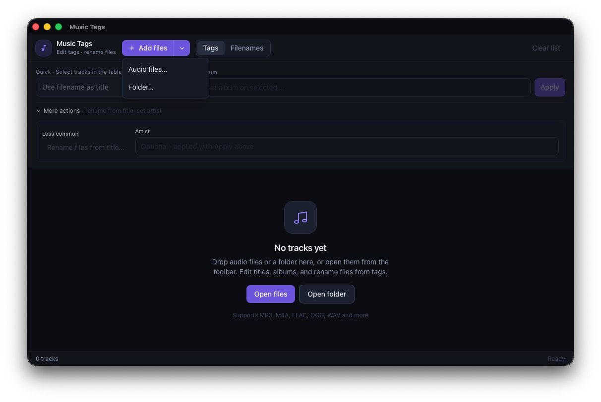

# Music Tags

A small desktop app to edit audio metadata and rename files from tags.



Built with **Tauri 2**, **SvelteKit**, **TypeScript**, and **Tailwind CSS**. Tag I/O uses the Rust [`lofty`](https://crates.io/crates/lofty) crate (MP3, M4A, FLAC, OGG, WAV, and more).

## Features

- Open files or a folder (recursive scan)
- Drag-and-drop files or folders onto the window
- Table of filename, title, album, artist, and path
- Double-click cells to edit title / album / artist in place
- **Filename → Title** — write the title tag from the base filename
- **Title → Filename** — rename with collision preview
- Bulk set **album** / **artist** on selected tracks
- Filename tools: prefix, suffix, find/replace, case, numbering
- Track detail panel with cover art and playback
- Undo / history for tag writes and renames
- Dark, dense UI with toasts and a status bar

## Requirements

- [Node.js](https://nodejs.org/) 18+
- [Rust](https://www.rust-lang.org/tools/install) (stable)
- Platform deps for Tauri: see [Tauri prerequisites](https://v2.tauri.app/start/prerequisites/)

## Develop

```bash
npm install
npm run tauri dev
```

## Build

```bash
npm run tauri build
```

Produces a native app bundle under `src-tauri/target/release/bundle/`.

## Tests

```bash
cd src-tauri && cargo test
npm run check
```

## Keyboard

| Shortcut | Action |
|----------|--------|
| ⌘/Ctrl+O | Open files |
| ⌘/Ctrl+⇧+O | Open folder |
| ⌘/Ctrl+A | Select all tracks (when focus is not in an input) |
| ⌘/Ctrl+Z | Undo last action |
| ⌘/Ctrl+⇧+Z | Open history |

## License

[MIT](LICENSE)
